# Laporan Proyek Machine Learning - Daffa Haidar Farras
## Domain Proyek (Kesehatan)
Diabetes melitus adalah salah satu penyakit tidak menular dengan tingkat penderita yang terus meningkat di dunia, termasuk Indonesia. Berdasarkan data dari International Diabetes Federation (IDF), jumlah penderita diabetes di Indonesia sudah mencapai 19,5 juta pada tahun 2021, dengan jumlah ini Indonesia menjadi salah satu negara dengan angka penderita diabetes tertinggi di dunia [1]. Diabetes menjadi penyebab utama komplikasi kesehatan serius, seperti penyakit  gagal ginjal, kardiovaskular, dan neuropati, yang dapat memberikan dampak pada kualitas hidup individu serta dapat memberi beban pada sistem layanan kesehatan nasional [2]. 
Peningkatan penderita diabetes di Indonesia disebabkan oleh beberapa faktor, termasuk perubahan gaya hidup, pola makan, kurangnya aktivitas fisik, dan kurangnya kesadaran petingnya pencegahan diabetes [3]. Diabetes yang merupakan penyakit kronis memerlukan penanganan jangka panjang, penanganannya berupa diet, gula darah, olahraga, dan pengobatan rutin. 

Pada jurnal “Projection of diabetes morbidity and mortality till 2045 in Indonesia based on risk factors and NCD prevention and control programs” yang ditulis oleh Wahidin, mugi dkk. Menurut penelitian yang mengambil data dari Riset Kesehatan Dasar (Riskesdas), BPJS Kesehatan, program Penyakit Tidak Menular (PTM), serta Kementerian Kesehatan. Penderita diabetes di Indonesia diperkirakan akan meningkat dari 9,19% pada tahun 2020 (setara dengan 18,69 juta kasus) menjadi 16,09% pada tahun 2045 (sekitar 40,7 juta kasus)[4]. 

Melihat fenomena ini diperlukannya inovasi yang bisa mencegah dan mendeteksi diabetes sejak dini. Salah satu pendekatan nya yaitu, dengan menggunakan machine learning untuk memprediksi dan mengidentifikasi potensi risiko penyakit diabetes berdasarkan data kesehatan individu. Pada projek ini menggunakan beberapa pendekatan algoritma machine learning antara lain : Random Forest, XGBoost, SVM, dan KNN. 

## Business Understanding
### Problem Statements
Rumusan masalah dari masalah latar belakang diatas adalah :
1. Bagaimana memprediksi penyakit diabetes sejak dini berdasarkan data kesehatan individu?
2. Bagaimana menidentifikasi fitur atau faktor utama yang bisa berkontribusi terhadap kemungkinana seseorang dapat menderita penyakit diabetes?  
3. Bagaimana membangun model machine learning yang bisa diandalkan untuk bisa membantu pengambilan keputusan diagnosis?
### Goals
Berdasarkan problem statements, berikut tujuan yang ingin dicapai pada proyek ini : 
1. Mengembangkan model machine learning yang bisa mengklasifikasi seseorang menderita diabetes atau tidak.
2. Mengetahui fitur atau faktor yang bisa berkontribusi terhadap kemungkinana seseorang dapat menderita penyakit diabetes.
3. Menemukan model terbaik yang bisa mengklasifikasi penderita diabetes.

### Solution Statement
1. Membangun dan mengembangkan model machine learning yang dapat mengklasifikasikan risiko penyakit diabetes.
2. Melakukan sebuah analisis pada data untuk bisa memahami fitur-fitur yang mempengaruhi seseorang dapat terkena penyakit diabetes, dengan menerapkan teknik visualisasi data dan deskripsi statistik data mengetahui korelasi antar fitur dan memahami hubungan antara data target (label) dan fitur lainnya.
3. Menggunakan confusion matrix dan f1 score pada masing-masing model machine learning untuk menemukan model terbaik berdasarkan akurasi tertinggi.

## Data Understanding
Dataset yang digunakan berisi informasi kesehatan individu yang dikumpulkan untuk membantu mengembangkan model untuk memprediksi penderita diabetes. Dataset ini diambil dari platform [Kaggle](https://www.kaggle.com/datasets/nanditapore/healthcare-diabetes) Dataset ini memiliki 10 fitur (termasuk label/target), dengan masing-masing baris mewakili satu entri individu.

| Kolom | Deskripsi |
| ---- |----- |
| **Id** | Identitas unik untuk setiap entri data. |
| **Pregnancies** | Jumlah kehamilan yang pernah dialami (indikator faktor risiko bagi wanita).|
| **Glucose** | Konsentrasi glukosa plasma selama 2 jam dalam tes toleransi glukosa oral. |
| **BloodPressure** | Tekanan darah diastolik (dalam mm Hg). |
| **SkinThickness** | Ketebalan lipatan kulit triceps (dalam mm). |
| **Insulin** | Kadar insulin serum selama 2 jam (mu U/ml). |
| **BMI** | Indeks massa tubuh (berat badan dalam kg dibagi tinggi badan dalam m²). |
| **DiabetesPedigreeFunction** | Nilai fungsi riwayat keluarga/genetik terhadap risiko diabetes. |
| **Age** | Usia individu (dalam tahun). |
| **Outcome** | Label hasil klasifikasi: 1 = positif diabetes, 0 = negatif diabetes.        |

Dengan : 
| Jumlah Baris | Jumlah Kolom |
| --- | --- |
| 2768 | 10 |

### Menangani duplicate value
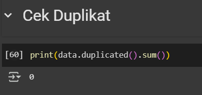

Dari hasil di atas, terlihat bahwa tidak ada data yang terduplikasi.
### Menangani Missing Value
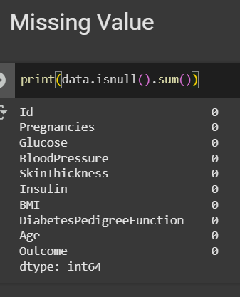

dari output diatas diketahui bahwa tidak terdapat missing value pada dataset yang digunakan, tetapi harus dicek apakah terdapat nilai nol pada tiap kolom karena tidak mungkin nilai pada kolom Pregnancies, Glucose, BloodPressure, SkinThickness, Insulin, BMI, DiabetesPedigreeFunction, Age. Karena bisa saja missing value nya diubah menjadi 0, hal ini dapat mempengaruhi peforma machine learning.
### Menangani Outlier
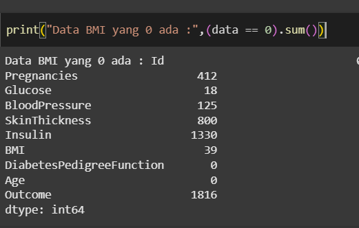

Setelah dicek ternyata terdapat banyak sekali yang bernilai 0, karena terdapat banyak sekali nilai 0 dan akan sangat berpengaruh ke peforma machine learning jika semuanya di drop. Maka, nilai 0 disini akan di ganti dengan nilai rata-rata pada setiap fitur. Terutama pada fitur Insulin, BMI, Glucose, dan SkinThickness yang tidak mungkin bernilai 0.
### Mengganti nilai 0 dengan nilai rata-rata
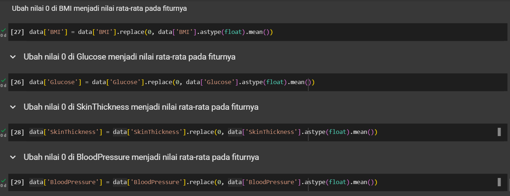

### Mengecek Outlier

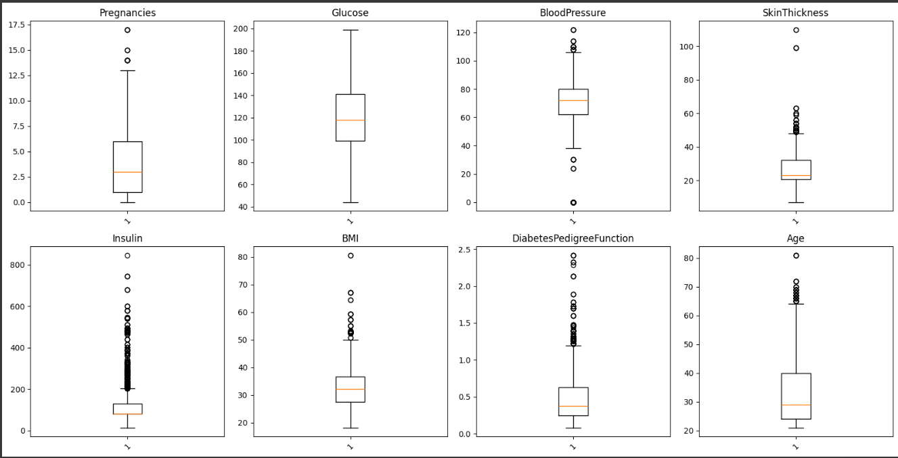

Hasilnya adalah :
1. Pregnancies
   Dapat dilihat mayoritas berada di angka 1-6. Terdapat outlier yaitu diatas 13. Tetapi, outlier ini tidak akan dihapus karena dalam beberapa kasus bisa saja wanita melahirkan lebih dari 13 kali.
2. Glucose
   Pada grafik Glucose terlihat normal tidak adanya outlier
3. BloodPressure
   Terdapat nilai nol, yang tidak masuk akal sebagai tekanan darah, kemungkinan data tidak valid atau hilang. Maka outlier ini akan diisi dengan nila rata-rata dari fiturnya.
4. SkinThickness
   Ada nilai nol dan outlier besar di atas 100 mm, yang jarang terjadi dalam praktik medis. Karena rentang rata-rata dalam dunia medis adalah 0-80 mm. oleh karena itu outlier ini akan diisi dengan nila rata-rata dari fiturnya.
5. Insulin
    Banyak nilai outlier sangat tinggi (hingga lebih dari 800). 
6. BMI
    Ada outlier di atas 50, bahkan mendekati 80. Karena BMI > 70  saja biasanya sudah dianggap sangat tinggi. Maka outlier ini akan diisi dengan nila rata-rata dari fiturnya.
7. DiabetesPedigreeFunction
    Terdapat Outlier di atas 2 menunjukkan risiko genetik tinggi. Maka outlier ini akan diisi dengan nila rata-rata dari fiturnya.
8. Age
    Tidak terlihat adanya keanehan dari distribusi data di fitur Age.

## Deskripsi Statistik dari Data
|index|Id|Pregnancies|Glucose|BloodPressure|SkinThickness|Insulin|BMI|DiabetesPedigreeFunction|Age|Outcome|
|---|---|---|---|---|---|---|---|---|---|---|
|count|2768\.0|2768\.0|2768\.0|2768\.0|2768\.0|2768\.0|2768\.0|2768\.0|2768\.0|2768\.0|
|mean|1384\.5|3\.7427745664739884|121\.8901180711016|72\.25643032259681|26\.843041030438705|80\.1278901734104|32\.590194462832876|0\.4711925578034682|33\.13222543352601|0\.3439306358381503|
|std|799\.1970970918251|3\.3238009672683835|30\.501026868115638|12\.007473411734374|9\.812960210906155|112\.30193298150999|7\.103630403759228|0\.32566883299525706|11\.777229987737929|0\.475104095143688|
|min|1\.0|0\.0|44\.0|24\.0|7\.0|0\.0|18\.2|0\.078|21\.0|0\.0|
|25%|692\.75|1\.0|99\.0|64\.0|20\.82442196531792|0\.0|27\.575000000000003|0\.244|24\.0|0\.0|
|50%|1384\.5|3\.0|118\.0|72\.0|23\.0|37\.0|32\.2|0\.375|29\.0|0\.0|
|75%|2076\.25|6\.0|141\.0|80\.0|32\.0|130\.0|36\.625|0\.624|40\.0|1\.0|
|max|2768\.0|17\.0|199\.0|122\.0|110\.0|846\.0|80\.6|2\.42|81\.0|1\.0|

## Univariate Analysis

Dari dataset yang digunakan diketahui bahwa hanya terdapat fitur bertipe data float dan int sehingga kita bisa memvisualisasikan datanya tanpa perlu memisahkan fitur-fitur yang memiliki tipedata yang berbeda

### Pregnancies

Top 10 dengan persentase paling banyak
|Pregnancies|jumlah sampel|persentase|
|---|---|---|
|1|491|17\.7|
|0|412|14\.9|
|2|387|14\.0|
|3|270|9\.8|
|4|259|9\.4|
|5|198|7\.2|
|6|181|6\.5|
|7|145|5\.2|
|8|134|4\.8|
|9|98|3\.5|

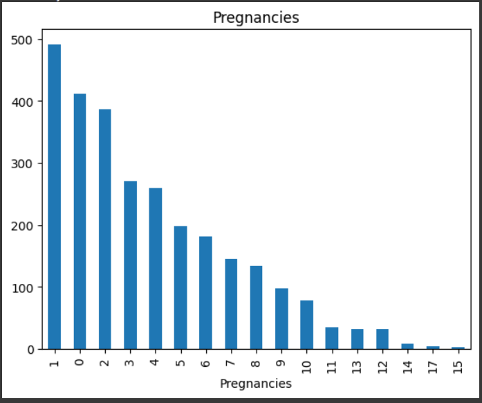

### Glucose

Top 10 dengan persentase paling banyak
|Glucose|jumlah sampel|persentase|
|---|---|---|
|99\.0|66|2\.4|
|100\.0|61|2\.2|
|102\.0|52|1\.9|
|129\.0|51|1\.8|
|106\.0|50|1\.8|
|95\.0|49|1\.8|
|112\.0|49|1\.8|
|111\.0|47|1\.7|
|105\.0|47|1\.7|
|125\.0|46|1\.7|

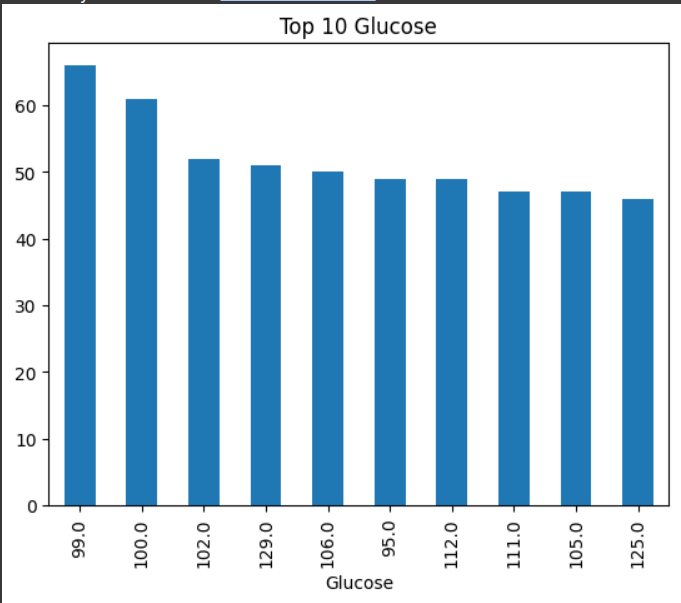

### BloodPressure

Top 10 dengan persentase paling banyak
|BloodPressure|jumlah sampel|persentase|
|---|---|---|
|70\.0|201|7\.3|
|74\.0|197|7\.1|
|78\.0|173|6\.2|
|68\.0|170|6\.1|
|64\.0|163|5\.9|
|72\.0|162|5\.9|
|80\.0|138|5\.0|
|76\.0|132|4\.8|
|60\.0|129|4\.7|
|62\.0|128|4\.6|

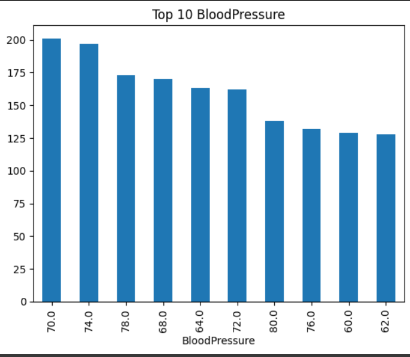

### SkinThickness

Top 10 dengan persentase paling banyak
|SkinThickness|jumlah sampel|persentase|
|---|---|---|
|20\.82442196531792|800|28\.9|
|32\.0|114|4\.1|
|30\.0|102|3\.7|
|23\.0|82|3\.0|
|27\.0|81|2\.9|
|28\.0|74|2\.7|
|18\.0|74|2\.7|
|33\.0|71|2\.6|
|39\.0|70|2\.5|
|31\.0|69|2\.5|

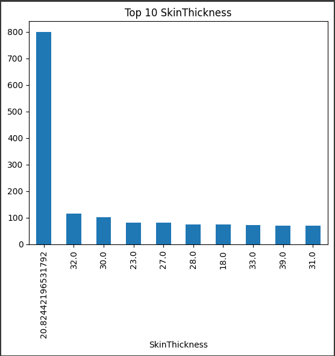

### Insulin

Top 10 dengan persentase paling banyak
|Insulin|jumlah sampel|persentase|
|---|---|---|
|0|1330|48\.0|
|105|42|1\.5|
|140|33|1\.2|
|130|31|1\.1|
|180|30|1\.1|
|120|29|1\.0|
|100|27|1\.0|
|94|24|0\.9|
|135|23|0\.8|
|76|22|0\.8|

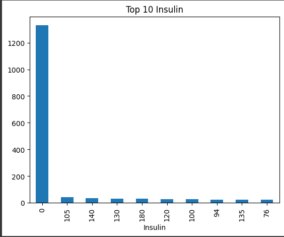

### BMI

Top 10 dengan persentase paling banyak
|BMI|jumlah sampel|persentase|
|---|---|---|
|32\.0|46|1\.7|
|31\.2|45|1\.6|
|31\.6|41|1\.5|
|32\.13739161849711|39|1\.4|
|33\.3|37|1\.3|
|32\.4|35|1\.3|
|32\.8|34|1\.2|
|30\.8|33|1\.2|
|32\.9|33|1\.2|
|30\.1|31|1\.1|

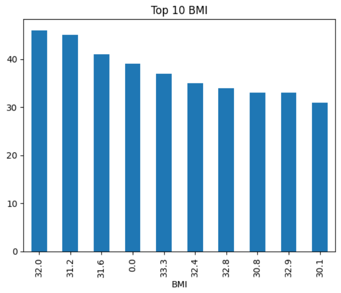

### DiabetesPedigreeFunction

Top 10 dengan persentase paling banyak
|DiabetesPedigreeFunction|jumlah sampel|persentase|
|---|---|---|
|0\.258|22|0\.8|
|0\.207|20|0\.7|
|0\.268|18|0\.7|
|0\.238|18|0\.7|
|0\.261|18|0\.7|
|0\.259|17|0\.6|
|0\.284|16|0\.6|
|0\.52|16|0\.6|
|0\.292|16|0\.6|
|0\.551|16|0\.6|

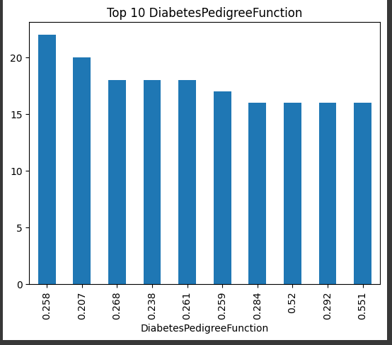

### Age

Top 10 dengan persentase paling banyak
|Age|jumlah sampel|persentase|
|---|---|---|
|22|264|9\.5|
|21|229|8\.3|
|25|182|6\.6|
|24|168|6\.1|
|23|141|5\.1|
|28|133|4\.8|
|26|117|4\.2|
|27|113|4\.1|
|29|99|3\.6|
|31|82|3\.0|

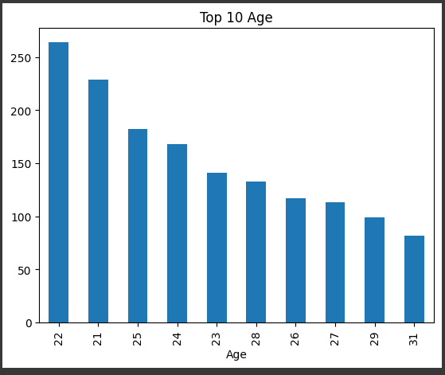

## Multivariate Analysis
### Umur vs Kondisi Diabetes
### BMI vs Kondisi Diabetes

## Referensi
---
1. Afriani, T., & Pudiyanti, P. (2020). Peran Teknologi Informasi dalam Perawatan Diabetes Mellitus. Nursing Current: Jurnal Keperawatan. https://doi.org/10.19166/NC.V8I1.2722
2. Rahmini, J. A., & Rahayuningtyas, D. K. (2020, Nov). Inovasi Kesehatan Terkini Sebagai Strategi Efektif Pada Manajemen Diabetes Di Masa Pandemi. Jurnal Keperawatan, 5(2). https://doi.org/10.32668/jkep.v5i2.453
3. Ardila, M., S. Humolungo, D. T., Amukti, D. P., & Akrom. (2024, Jun). PROMOSI KESEHATAN PENCEGAHAN DAN PENGENDALIAN DIABETES MELITUS PADA REMAJA. J . A . I : Jurnal Abdimas Indonesia, 4(2). https://doi.org/10.53769/jai.v4i2.729
4. Wahidin, M. Achadi, A. DKK. (2024). Projection of diabetes morbidity and mortality till 2045 in Indonesia based on risk factors and NCD prevention and control programs. Scientific report. https://www.nature.com/articles/s41598-024-54563-2
